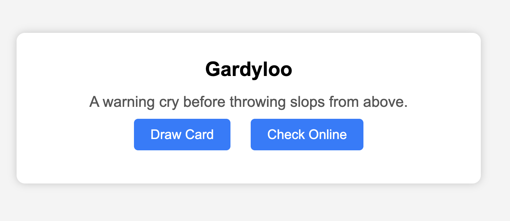

In case you find yourself of a family vacation, disconnected from your Balderdash game, here is some code so you can replicate the experience of drawing Balderdash cards in your browser.

The code was generated by an LLM, so the "check online" button helps protect against LLM hallucinations and answer the question, "Did the LLM make up this word and definition?"

To run the site locally, navigate to the index.html file's directory and run:

python -m http.server

